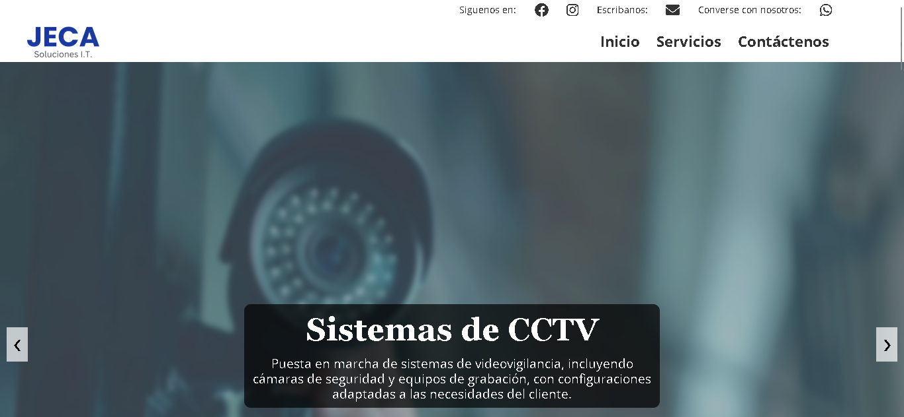

# JECA Soluciones T.I.

Sitio web creado en **HTML5** con soporte para estilos gestionados mediante CSS, diseñado para presentar los servicios tecnológicos de **JECA Soluciones T.I.**.

## Características

- **Responsive Design:** 
- **Google Analytics:** 
- **Animaciones:** 
- **Soporte de Formularios:** 
- **Cárrusel Dinámico:** 
- **Diseño Modular:** 

## Estructura del Proyecto

```
├── img
│   ├── logos
│   └── slides
├── css
│   ├── base
│   ├── components
│   └── layout
├── js
└── index.html
```

- **img:** Contiene imágenes y logotipos utilizados en el sitio.
- **css:** Estructurado en carpetas para reset, componentes y diseño del layout.
- **js:** Scripts necesarios para funcionalidad y animaciones.
- **index.html:** Archivo principal del proyecto.

## Dependencias

- [AOS](https://michalsnik.github.io/aos/): Animaciones.
- [Font Awesome](https://fontawesome.com/): Iconos para mejorar la experiencia visual.
- [EmailJS](https://www.emailjs.com/): Integración para el envío de formularios.

## Captura de Pantalla



## Autoría

Este código es propiedad de **Carlos Javier**. Todos los derechos reservados. No está permitido copiar, modificar o distribuir este código sin autorización expresa del autor.

## Licencia

El contenido de este repositorio está protegido. El uso o reproducción del mismo está estrictamente prohibido sin el consentimiento del autor.